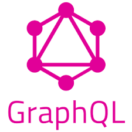
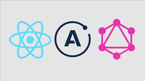

### Hi there 👋

<!-- 
**CarlosGiovannyG/CarlosGiovannyG** is a ✨ _special_ ✨ repository because its `README.md` (this file) appears on your GitHub profile.

Here are some ideas to get you started:

- 🔭 I’m currently working on ...
- 🌱 I’m currently learning ...
- 👯 I’m looking to collaborate on ...
- 🤔 I’m looking for help with ...
- 💬 Ask me about ...
- 📫 How to reach me: ...
- ⚡ Fun fact: ... -->

<mark>

# 😄 CARLOS GIOVANNY GUALTERO LONDOÑO

## FULLSTACK DEVELOPER 
___
   

### El mundo de la informática sin dudas es mi lugar.

***El mundo de la informática sin dudas es mi lugar. Me fascina la idea da saber que tengo la capacidad de dar soluciones a las diferentes problemáticas del día a día por medio de la tecnología***

>Formado como Full Stack Developer cuento con experiencia en Formado como Full Stack Developer cuento con experiencia en:

- NodeJS
- React
- Redux
- SQL
- Python
- GraphQl
- ApolloServer
- entre otras tecnologías del sector

 
   
     
   
   
    
    
   
     
 

# Contacto

<table style="width:80%"  border="10">
  <tr> 
    <td>
   
	</td>
  <td>
	  
	</td>	   
  <td>
	  
	</td>	   
  <td>
	

  <a  href="tel:3043912387" target="_blank"> Telefono: +573043912387 </a>
  
  
	</td>	   
  </tr>  
</table>

 </mark>

